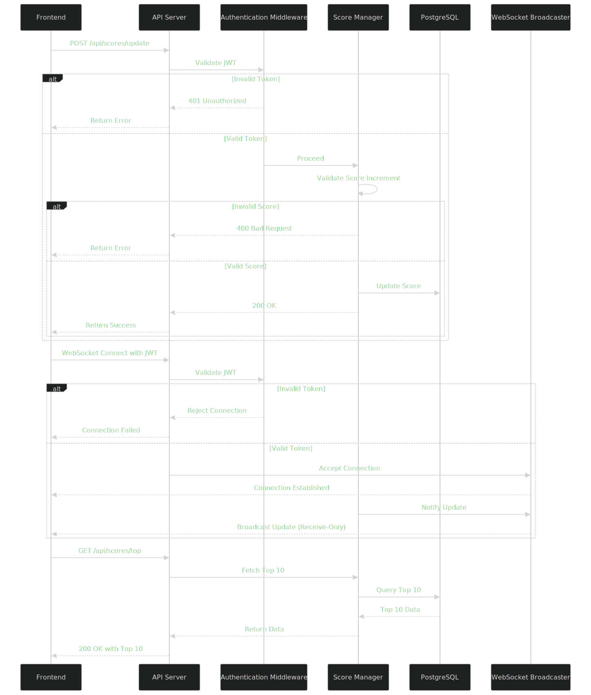
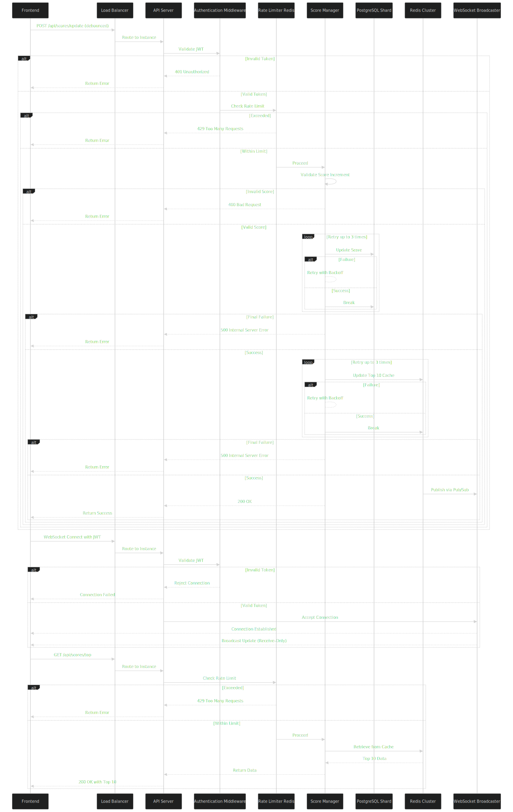

# Scores API Module

This module provides a backend API service to manage a live-updating scoreboard.

## Overview

The Scores API Module is designed to:

- Accept score update requests from users upon completing an action.
- Validate and authenticate requests to prevent unauthorized score manipulation.
- Persistently store and update user scores in a database.
- Maintain and broadcast a real-time top 10 leaderboard to the frontend.

## API Endpoints

### 1. Update User Score

- **Endpoint**: `POST /api/scores/update`

- **Description**: Updates a user's score after completing an action and persists it in the database.

- **Request Headers**:

  - `Authorization`: Bearer token (JWT) to authenticate the user.

- **Request Body**:

  ```json
  {
    "userId": "string", // Unique user identifier
    "scoreIncrement": "integer" // Amount to increase the score by (positive integer)
  }
  ```

- **Response**:

  - **Success (200)**:

    ```json
    {
      "status": "success",
      "message": "Score updated",
      "newScore": "integer"
    }
    ```

  - **Error (400)**:

    ```json
    {
      "status": "error",
      "message": "Invalid score increment"
    }
    ```

  - **Error (401)**:

    ```json
    {
      "status": "error",
      "message": "Unauthorized"
    }
    ```

  - **Error (429)**:

    ```json
    {
      "status": "error",
      "message": "Too many requests"
    }
    ```

  - **Error (500)**:

    ```json
    {
      "status": "error",
      "message": "Internal server error after retries"
    }
    ```

    _(Scaled Approach only, after retry logic exhaustion)_

- **Authentication**: Requires a valid JWT token tied to the `userId`.

### 2. Get Top 10 Scores

- **Endpoint**: `GET /api/scores/top`

- **Description**: Retrieves the current top 10 users and their scores.

- **Response**:

  ```json
  {
    "status": "success",
    "message": "Score updated",
    "newScore": "integer"
  }
  ```

- **Authentication**: Public endpoint (no authentication required).

## Real-Time Updates

- **WebSocket Endpoint**: `ws://<server-url>/scores/live`.

- **Description**: Clients connect to receive live updates of the top 10 scoreboard. Connections require authentication via a JWT token sent in the handshake (e.g., as a query parameter `?token=<JWT>` or header). Only authenticated clients receive updates, and the server prevents client-side data sending by rejecting incoming messages, making it receive-only.

- **Message Format**:

  ```json
  {
    "event": "scoresUpdate",
    "topScores": [
      { "userId": "string", "score": "integer", "rank": "integer" },
      ...
    ]
  }
  ```

## Basic Approach

### Architecture

- **Components**: Single API server, single PostgreSQL instance, no Redis or load balancer.

- **Flow**: Direct database updates and WebSocket broadcasting.

### Technologies & Tools

- Node.js (v18+), PostgreSQL, JWT library, WebSocket library (e.g., `ws` with authentication support).

### Database Schema

**Table**: `user_score`

| Column Name    | Data Type    | Constraints                         | Description                     |
| -------------- | ------------ | ----------------------------------- | ------------------------------- |
| `user_id`      | VARCHAR(255) | PRIMARY KEY                         | Unique identifier for the user  |
| `score`        | INTEGER      | NOT NULL, DEFAULT 0                 | User's total score              |
| `last_updated` | TIMESTAMP    | NOT NULL, DEFAULT CURRENT_TIMESTAMP | Last time the score was updated |

**SQL Definition**

```sql
CREATE TABLE user_scores (
    user_id VARCHAR(255) PRIMARY KEY,
    score INTEGER NOT NULL DEFAULT 0,
    last_updated TIMESTAMP NOT NULL DEFAULT CURRENT_TIMESTAMP
);
CREATE INDEX idx_user_scores_score ON user_scores (score DESC);
```

### Flow of Execution

1. A user completes an action on the frontend (e.g., clicks a button).

2. The frontend sends a `POST /api/scores/update` request with a JWT token and score increment.

3. The single API server receives the request directly.

4. The server validates the JWT token via the authentication middleware; if invalid, it returns a 401 Unauthorized response.

5. With a valid token, the Score Manager validates the `scoreIncrement`; if invalid (e.g., negative or non-integer), it returns a 400 Bad Request response.

6. If the score increment is valid, the Score Manager updates the user’s score in the single PostgreSQL instance.

7. The Score Manager recalculates the top 10 scores directly from the PostgreSQL database.

8. Meanwhile, the frontend establishes a WebSocket connection to `ws://<server-url>/scores/live` with the same JWT token; the server validates the token, rejecting unauthenticated or invalid connections.

9. The WebSocket Broadcaster, running on the server, pushes the updated top 10 to all connected, authenticated frontend clients.

10. The frontend receives the WebSocket update and refreshes the scoreboard in real-time; attempts to send data via WebSocket are rejected by the server.

11. Separately, when the frontend requests `GET /api/scores/top`, the API server fetches the top 10 directly from PostgreSQL and returns it.

### Flow Diagram



### UML Sequence Diagram



### Limitations

- **Capacity**: Limited to ~1K concurrent users and 10K updates/day with a single server.

- **Performance**: Database slows beyond 10K users without caching or scaling.

- **Reliability**: Single server and database create failure points without replication or horizontal scaling.

### Scalability & Improvements

- **Frontend**: Add debouncing (e.g., 500ms) to `POST /api/scores/update` requests and a basic load balancer (e.g., Nginx) to distribute 1K-3K authenticated WebSocket clients; implement client-side rate limiting with headers (e.g., `X-RateLimit-Remaining`) for feedback.

- **Database**: Introduce a second PostgreSQL instance with basic sharding (e.g., by `user_id` range) to scale to 20K+ users, paired with a lightweight Redis instance for top 10 caching.

- **API**: Transition to 2-3 API servers behind a load balancer to handle increased load beyond 1K concurrent users; add Redis-based rate limiting for API and WebSocket connections. Basic rate limiting can be added early if abuse is a concern.

- **WebSocket**: Use a lightweight Redis instance for pub/sub to broadcast updates across 2-3 servers, supporting up to 3K authenticated clients.

- **Additional**: Retry logic for failed operations enhances robustness across all components.

## Scaled Approach

### Architecture

- **Components**: Multiple API servers, sharded PostgreSQL, Redis Cluster, load balancer, WebSocket broadcaster.

- **Flow**: Load-balanced requests, sharded database updates, Redis caching, and authenticated pub/sub broadcasting.

### Technologies & Tools

- Node.js (v18+), PostgreSQL (sharded), Redis Cluster, JWT library, WebSocket library (e.g., `ws` with authentication support), rate limiting library, load balancer.

### Database Schema

**Table**: `user_score` _(Sharded)_

| Column Name    | Data Type    | Constraints                         | Description                     |
| -------------- | ------------ | ----------------------------------- | ------------------------------- |
| `user_id`      | VARCHAR(255) | PRIMARY KEY                         | Unique identifier for the user  |
| `score`        | INTEGER      | NOT NULL, DEFAULT 0                 | User's total score              |
| `last_updated` | TIMESTAMP    | NOT NULL, DEFAULT CURRENT_TIMESTAMP | Last time the score was updated |

**SQL Definition**

```sql
CREATE TABLE user_scores (
    user_id VARCHAR(255) PRIMARY KEY,
    score INTEGER NOT NULL DEFAULT 0,
    last_updated TIMESTAMP NOT NULL DEFAULT CURRENT_TIMESTAMP
);
CREATE INDEX idx_user_scores_score ON user_scores (score DESC);
```

### Flow of Execution

1. A user completes an action on the frontend (e.g., clicks a button).

2. The frontend debounces the action (e.g., 500ms) and sends a `POST /api/scores/update` request with a JWT token and score increment.

3. The load balancer receives the request and routes it to an available API server instance based on load and availability.

4. The API server validates the JWT token via the authentication middleware; if invalid, it returns a 401 Unauthorized response.

5. If the token is valid, the request passes to the Redis-based rate limiter, which checks the user’s request quota (e.g., 100/hour); if exceeded, it returns a 429 Too Many Requests response.

6. With a valid token and within rate limits, the Score Manager validates the `scoreIncrement`; if invalid (e.g., negative or non-integer), it returns a 400 Bad Request response.

7. If the score increment is valid, the Score Manager attempts to update the user’s score in the appropriate PostgreSQL shard based on the `userId`; if the operation fails (e.g., due to a transient error), it retries up to 3 times with exponential backoff before proceeding or failing with a 500 Internal Server Error.

8. Upon successful database update, the Score Manager recalculates the top 10 scores and updates the Redis Cluster cache with the new leaderboard; if the Redis update fails, it retries up to 3 times with exponential backoff before proceeding or failing with a 500 Internal Server Error.

9. The Redis Cluster publishes the updated top 10 to a pub/sub channel (e.g., `scores_channel`).

10. Meanwhile, the frontend establishes a WebSocket connection to `ws://<server-url>/scores/live` with the same JWT token; the server validates the token, rejecting unauthenticated or invalid connections.

11. All authenticated API server instances, subscribed to the Redis channel, receive the update via the WebSocket Broadcaster and push it to connected, authenticated frontend clients.

12. The frontend receives the WebSocket update and refreshes the scoreboard in real-time; attempts to send data via WebSocket are rejected by the server.

13. Separately, when the frontend requests `GET /api/scores/top`, the load balancer routes it to an API server instance; the server passes it to the Redis-based rate limiter, which checks the user’s quota (e.g., 100/hour); if exceeded, it returns a 429 Too Many Requests response; if within limits, the Score Manager fetches the top 10 from the Redis Cluster cache and returns it.

### Flow Diagram



### UML Sequence Diagram



### Limitations

- **Complexity**: High operational overhead due to multiple components (shards, Redis Cluster, load balancer).

- **Cost**: Significant infrastructure costs with 10+ servers, sharded databases, and Redis nodes.

- **Latency**: Potential delays in multi-region setups or during Redis pub/sub under extreme load.

### Scalability & Improvements

- **Frontend**: Deploy a CDN (e.g., Cloudflare) to cache `GET /api/scores/top` responses globally, reducing API load; distribute WebSocket connections across multi-region load balancers; implement client-side rate limiting with headers (e.g., `X-RateLimit-Remaining`) for feedback. Consider monitoring (Prometheus/Grafana) to optimize frontend performance.

- **Database**: Increase to 20+ PostgreSQL shards to handle 2M+ users, using a shard manager for dynamic allocation based on load.

- **Caching**: Expand Redis Cluster to 12+ nodes for higher throughput and redundancy across regions.

- **API**: Scale API instances beyond 10 with auto-scaling groups in multiple regions, enhancing load balancer distribution; add Redis-based rate limiting for API and WebSocket connections; implement logging (e.g., ELK stack) and monitoring (e.g., Prometheus/Grafana) to track performance and identify bottlenecks.

- **WebSocket**: Implement multi-region Redis Pub/Sub clusters to support 100K+ authenticated clients with low-latency broadcasts.
